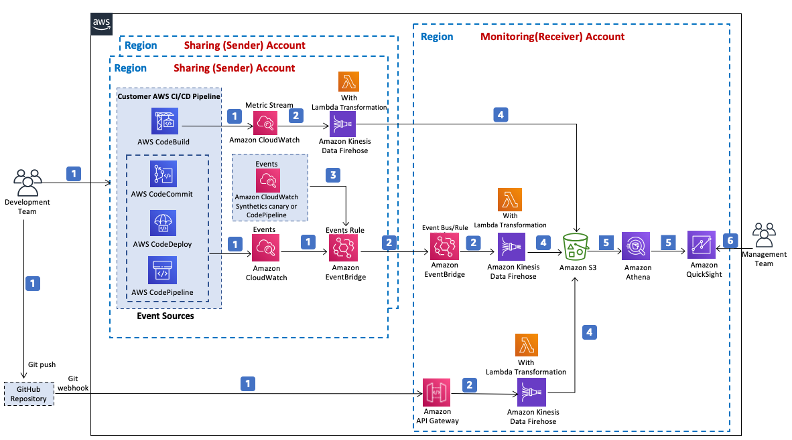

**[🚀 Solution Landing Page](<https://aws.amazon.com/solutions/implementations/aws-devops-monitoring-dashboard/>)** | **[🚧 Feature request](https://github.com/aws-solutions/aws-devops-monitoring-dashboard/issues/new?assignees=&labels=feature-request%2C+enhancement&template=feature_request.md&title=)** | **[🐛 Bug Report](https://github.com/aws-solutions/aws-devops-monitoring-dashboard/issues/new?assignees=&labels=bug%2C+triage&template=bug_report.md&title=)**

Note: If you want to use the solution without building from source, navigate to Solution Landing Page

## Table of contents

- [Solution Overview](#solution-overview)
- [Architecture Diagram](#architecture-diagram)
- [AWS CDK Constructs](#aws-solutions-constructs)
- [Customizing the Solution](#customizing-the-solution)
  - [Prerequisites for Customization](#prerequisites-for-customization)
  - [Build](#build)
  - [Unit Test](#unit-test)
  - [Deploy](#deploy)
- [File Structure](#file-structure)
- [License](#license)

<a name="solution-overview"></a>
# Solution Overview

The AWS DevOps Monitoring Dashboard solution is a reference implementation that automates the process for monitoring and visualizing performance and operational metrics in continuous integration/continuous delivery (CI/CD) pipeline following AWS best practices. This solution allows organizations of all sizes to track and measure the activities of their development teams. This helps DevOps leaders measure the impact of their DevOps initiatives and make data-driven decisions to drive continuous improvement in their software delivery process.

This solution supports ingestion, analysis and visualization of data from AWS Developer Tools to calculate key DevOps metrics, such as Change Failure Rate, Deployment, Code Change Volume and more. These metrics are presented in Amazon QuickSight dashboards for visualization.

This solution can be easily installed in your AWS accounts via launching the provided AWS CloudFormation template.

For a detailed solution implementation guide, refer to Solution Landing Page [AWS DevOps Monitoring Dashboard](https://aws.amazon.com/solutions/implementations/aws-devops-monitoring-dashboard)

<a name="architecture-diagram"></a>
# Architecture Diagram

<p align="center">
  
  <br/>
</p>

1.	A developer initiates an activity in an AWS CI/CD pipeline, such as pushing a code change to AWS CodeCommit or deploying an application using AWS CodeDeploy. These activities create events. For development using GitHub repository, git push events are generated.
2.	An Amazon EventBridge events rule detects the events based on predefined event patterns and then sends the event data to an Amazon Kinesis Data Firehose delivery stream. One event rule is created per event source. For activities in AWS CodeBuild, a CloudWatch metric stream is set up to capture CloudWatch metrics and deliver them to a Kinesis Data Firehose delivery stream. For GitHub push events, an Amazon API endpoint is created to post these events and deliver them to a Kinesis Data Firehose delivery stream.
3.	An Amazon EventBridge events rule is also created to capture events from an Amazon CloudWatch alarm that monitors the status of an Amazon CloudWatch synthetics canary, if you have set up the canary and alarm in your account. This alarm is needed to gather data for calculating Mean Time to Recover (MTTR) metrics.
4.	Amazon Kinesis Data Firehose uses an AWS Lambda function for data transformation. The Lambda function extracts relevant data to each metric and sends it to an Amazon S3 bucket for downstream processing.
5.	An Amazon Athena database queries the Amazon S3 bucket data and returns query results to Amazon QuickSight.
6.	Amazon QuickSight obtains the query results and builds dashboard visualizations for your management team.


<a name="aws-solutions-constructs"></a>
# AWS Solutions Constructs
[AWS CDK Solutions Constructs](https://aws.amazon.com/solutions/constructs/) make it easier to consistently create well-architected applications. All AWS Solutions Constructs are reviewed by AWS and use best practices established by the AWS Well-Architected Framework. This solution uses the following AWS CDK Constructs:

-   aws-eventbridge-kinesisfirehose-s3
-   aws-eventbridge-lambda
-   aws-kinesisfirehose-s3


<a name="aws-solutions-constructs"></a><a name="customizing-the-solution"></a>
# Customizing the Solution

<a name="prerequisites-for-customization"></a>
## Prerequisites for Customization

* [AWS Command Line Interface](https://aws.amazon.com/cli/)
* Python 3.8

<a name="build"></a>
## Build

Building from GitHub source will allow you to modify the solution, such as adding custom actions or upgrading to a new release. The process consists of downloading the source from GitHub, creating Amazon S3 buckets to store artifacts for deployment, building the solution, and uploading the artifacts to S3 in your account.

#### 1. Clone the repository

Clone or download the repository to a local directory on your linux client. Note: if you intend to modify the source code you may wish to create your own fork of the GitHub repo and work from that. This allows you to check in any changes you make to your private copy of the solution.

**Git Clone example:**

```
git clone https://github.com/aws-solutions/aws-devops-monitoring-dashboard.git
```

**Download Zip example:**
```
wget https://github.com/aws-solutions/aws-devops-monitoring-dashboard/archive/master.zip
```

#### 2. Unit test
Next, run unit tests to make sure your customized code passes the tests

```
cd <rootDir>/deployment
chmod +x ./run-unit-tests.sh
./run-unit-tests.sh
```

#### 3. Create S3 buckets for storing deployment assets

AWS Solutions use two buckets:

* One global bucket that is accessed via the http end point. AWS CloudFormation templates are stored here. Ex. "mybucket"
* One regional bucket for each region where you plan to deploy the solution. Use the name of the global bucket as the prefix of the bucket name, and suffixed with the region name. Regional assets such as Lambda code are stored here. Ex. "mybucket-us-east-1"
  * Inside this bucket, create a folder named with the same solution name specified below in the environment variables section; and inside that, create another folder named with the same version number specified below. Here is how a sample folder/prefix would look like: "aws-devops-monitoring-dashboard/V1.0.0". 
* The assets in buckets must be accessible by your account

#### 4. Declare environment variables
```
export DIST_OUTPUT_BUCKET=<YOUR_DIST_OUTPUT_BUCKET> # Name for the regional bucket where regional assets are stored
export SOLUTION_NAME="aws-devops-monitoring-dashboard" # name of the solution
export VERSION=<VERSION> # version number for the customized solution
export AWS_REGION=<AWS_REGION> # region where the solution is deployed
export CF_TEMPLATE_BUCKET_NAME=<YOUR_CF_TEMPLATE_BUCKET_NAME> # Name of the global bucket where CloudFormation templates are stored
export QUICKSIGHT_TEMPLATE_ACCOUNT = <YOUR_QUICKSIGHT_TEMPLATE_ACCOUNT> # The AWS account from which the Amazon QuickSight templates should be sourced for Amazon QuickSight Analysis and Dashboard creation
export DIST_QUICKSIGHT_NAMESPACE = <YOUR_DIST_QUICKSIGHT_NAMESPACE >
# The namespace in QuickSight account ARN. Ex. "default"
```
#### 5. Build the solution
```
cd <rootDir>/deployment
chmod +x build-s3-dist.sh
./build-s3-dist.sh $DIST_OUTPUT_BUCKET $SOLUTION_NAME $VERSION $CF_TEMPLATE_BUCKET_NAME $QUICKSIGHT_TEMPLATE_ACCOUNT $DIST_QUICKSIGHT_NAMESPACE
```

<a name="Upload-deployment-assets-to-your-S3-buckets"></a>
## Upload Deployment Assets
* Copy the cloudformation templates (.template files) from the directory `./deployment/global-s3-assets` into the global S3 bucket with the name referenced to `$CF_TEMPLATE_BUCKET_NAME`.
* Copy the lambda distribution files (.zip files) from the directory `./deployment/regional-s3-assets` into the folder/prefix `$SOLUTION_NAME/$VERSION` in the regional S3 bucket with the name referenced to `$DIST_OUTPUT_BUCKET-[REGION]`. `[REGION]` is the specific region where the solution is being deployed.

<a name="create-quicksight-template"></a>
## Create QuickSight Template

If you customize the solution, you will need to create the Amazon QuickSight template in your AWS account where the out-of-box solution is originally deployed, in order to successfully deploy QuickSight resources as part of your customized solution. Follow these steps to create the template using [QuickSight CLI commands](https://docs.aws.amazon.com/cli/latest/reference/quicksight/index.html):
* Run list commands to get the ARNs of the QuickSight analysis and datasets used by the out-of-box solution in your AWS account where the solution is deployed.
```
aws quicksight list-analyses --aws-account-id your-aws-account-id
aws quicksight list-data-sets --aws-account-id your-aws-account-id
```
* Create a json data as shown below with your information such as AWS account id, QuickSight template id/name, analysis and dataset ARNs. Save it as a json file, for example, “create-template-from-analysis-cli-input.json”.
```
{
    "AwsAccountId": "your-aws-account-id",
    "TemplateId": "your-quicksight-template-id",
    "Name": "your-quicksight-template-name",
    "SourceEntity": {
        "SourceAnalysis": {
            "Arn": "your-quicksight-analysis-arn",
            "DataSetReferences": [
                {
                    "DataSetPlaceholder": "code-change-activity",
                    "DataSetArn": "your-quicksight-code-change-activity-dataset-arn"
                },
                {
                    "DataSetPlaceholder": "code-deployment-detail",
                    "DataSetArn": "your-quicksight-code-deployment-detail-dataset-arn"
                },
                {
                    "DataSetPlaceholder": "recovery-time-detail",
                    "DataSetArn": "your-quicksight-recovery-time-detail-dataset-arn"
                },
                {
                    "DataSetPlaceholder": "code-pipeline-detail",
                    "DataSetArn": "your-quicksight-code-pipeline-detail-dataset-arn"
                },
                {
                    "DataSetPlaceholder": "code-build-detail",
                    "DataSetArn": "your-quicksight-code-build-detail-dataset-arn"
                },
                {
                    "DataSetPlaceholder": "github-change-activity",
                    "DataSetArn": "your-quicksight-github-change-activity-dataset-arn"
                }
            ]
        }
    },
    "VersionDescription": "1"
}
```
* Run create-template command to create template from the analysis json file above.
```
aws quicksight create-template \
    --cli-input-json file://./create-template-from-analysis-cli-input.json \
    --region your-region
```
* (Optional) If you want to use the QuickSight template in another account, run update-template-permissions command to grant the quicksight:DescribeTemplate permission to public or your target account. This is NOT needed if you use the template in the same account where the solution is deployed.
```
aws quicksight update-template-permissions --region $AWS_REGION \
     --aws-account-id your-aws-account-id \
     --template-id your-quicksight-template-id \
     --grant-permissions "[{\"Principal\": \"*\", \"Actions\": [\"quicksight:DescribeTemplate\"]}]"
```
* Run describe-template command to view the template created above.
```
aws quicksight describe-template \
    --aws-account-id your-aws-account-id \
    --template-id your-quicksight-template-id
```
* (Optional) If you customize QuickSight such as adding a new dataset to analysis or making changes to visualization, you can update the analysis json file as needed and then call update-template command to update your template accordingly.
```
aws quicksight update-template \
    --cli-input-json file://./create-template-from-analysis-cli-input.json \
    -—region your-region
```

<a name="deploy"></a>
## Deploy

* From your designated Amazon S3 bucket where you uploaded the deployment assets, copy the link location for the aws-devops-monitoring-dashboard.template.
* Using AWS CloudFormation, launch the AWS DevOps Monitoring Dashboard solution stack using the copied Amazon S3 link for the aws-devops-monitoring-dashboard.template.

<a name="file-structure"></a>
# File structure

AWS DevOps Monitoring Dashboard solution consists of:

- CDK constructs to generate necessary AWS resources
- Microservices used in the solution

<pre>
├── deployment                          [folder containing build scripts]
│   ├── cdk-solution-helper             [A helper function to help deploy lambda function code through S3 buckets]
└── source                              [source code containing CDK App and lambda functions]
    ├── bin                             [entry point of the CDK application]
    ├── image                           [folder containing images of the solution such as architecture diagram]
    ├── lambda                          [folder containing source code for lambda functions]
    │   ├── event_parser                [lambda code for parsing raw events data]
    │   ├── query_runner                [lambda code for building and running Athena queries]
    │   ├── quicksight-custom-resources [lambda code for creating QuickSight resources]
    │   └── solution_helper             [lambda code for performing helper tasks]
    ├── lib                             [folder containing CDK constructs]
    │   ├── database                    [CDK constructs for creating database resources]
    │   ├── deployment-helper           [CDK constructs for creating optional CloudFormation templates that help with solution deployment]
    │   ├── events                      [CDK constructs for creating events/metrics resources]
    │   ├── quicksight-custom-resources [CDK constructs for creating QuickSight CloudFormation template]
    │   └── solution-helper             [CDK constructs for creating solution helper lambda resources in CloudFormation]
    ├── test                            [test folder for CDK]
</pre>

<a name="Collection of operational metrics"></a>
# Collection of operational metrics

This solution collects anonymous operational metrics to help AWS improve the quality and features of the solution. For more information, including how to disable this capability, please see the [implementation guide](https://docs.aws.amazon.com/solutions/latest/aws-devops-monitoring-dashboard/collection-of-operational-metrics.html).

<a name="license"></a>
# License

See license [here](https://github.com/aws-solutions/aws-devops-monitoring-dashboard/blob/master/LICENSE.txt)